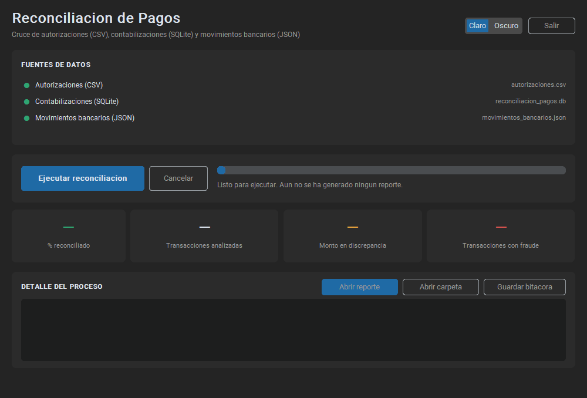
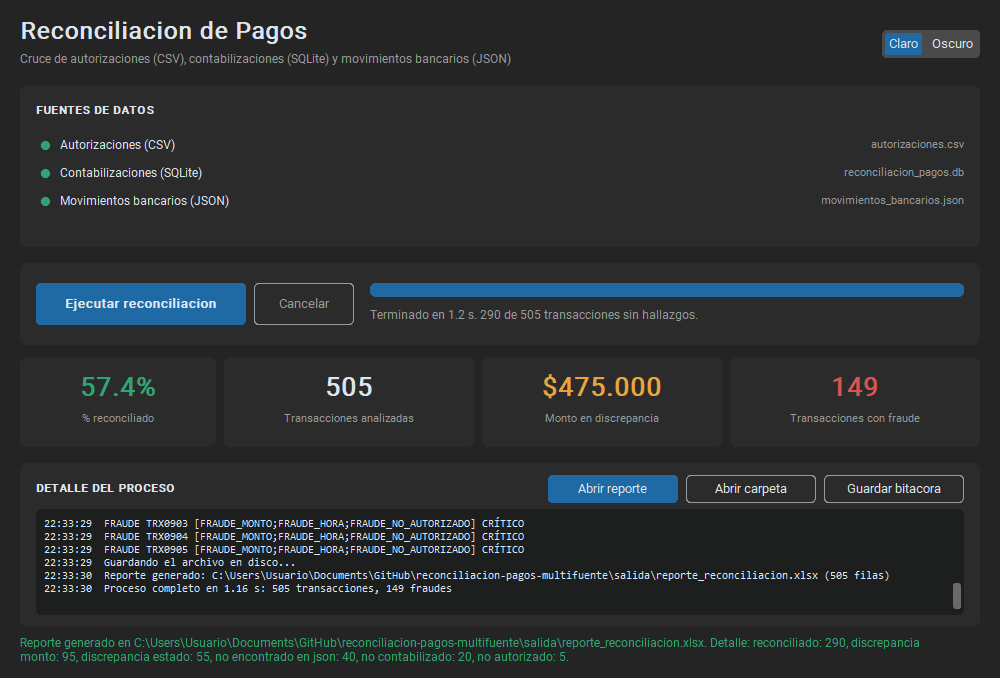

# Reconciliación de Pagos Multi-Fuente

[](https://github.com/EmanuelVM2002/reconciliacion-pagos-multifuente/actions/workflows/pruebas.yml)

Tres sistemas hablan de las mismas transacciones y no siempre coinciden. Esto
las cruza, encuentra dónde se despegan, marca lo que huele a fraude y lo deja
todo en un Excel.

| Fuente | Archivo | Qué es | Cómo llama a la llave |
|---|---|---|---|
| CSV | `autorizaciones.csv` | Lo que se **autorizó** | `ID_Transaccion` |
| SQLite | `reconciliacion_pagos.db` | Lo que se **contabilizó** | `Referencia` |
| JSON | `movimientos_bancarios.json` | Lo que **llegó al banco** | `transaccion_id` |

## Cómo se ejecuta

```bash
pip install -r requirements.txt
```

**Con interfaz** — doble clic en `ejecutar_gui.bat`, o:

```bash
python ejecutar_gui.py
```

**Por terminal:**

```bash
python main.py
```

Las dos hacen lo mismo y dejan el Excel en `salida/reporte_reconciliacion.xlsx`.
No hay que buscar ni seleccionar archivos: las rutas están en
`reconciliacion/config/rutas.py`.

**Pruebas:**

```bash
python -m pytest                      # 172 pruebas
python -m mypy reconciliacion         # tipos, en modo estricto
```

## Qué encontró

| | |
|---|---|
| Universo analizado (unión de las 3 fuentes) | **505** transacciones |
| Reconciliadas | 290 (57,4 %) |
| Sin clasificar | **0** |
| Discrepancia de monto / de estado | 95 / 55 |
| Faltantes: sin banco / sin contabilizar / sin autorizar | 40 / 20 / 5 |
| Con algún patrón de fraude | 149 |
| Monto en discrepancia | $475.000 |
| Filas del CSV con extracción completa | **500 de 500** |

Todo esto sale en 1,2 segundos.

## La interfaz





## Dónde está cada cosa

```
reconciliacion/
├── config/rutas.py     Todas las rutas, en un solo lugar
├── dominio/            Los modelos del negocio
├── loaders/            Un cargador por fuente
├── limpieza/           Sacar los datos de los campos rotos
├── procesamiento/      Cruzar, clasificar y buscar fraude
├── exportadores/       Armar el Excel
├── gui/                La ventana
└── servicio.py         El proceso completo, de punta a punta
```

Separé por capas para que cada pieza tenga una sola razón para cambiar: los
*loaders* solo leen, la *limpieza* solo interpreta, el *procesamiento* solo
decide y los *exportadores* solo presentan. En la práctica eso significa que
puedo probar el parseo de un campo roto pasándole un string, y que agregar una
cuarta fuente mañana es escribir un cargador nuevo y nada más.

`servicio.py` merece mención aparte: es el único sitio que conoce el proceso
entero. La terminal y la ventana llaman ahí, así que **corren exactamente el
mismo código** y no hay riesgo de que una quede desactualizada.

---

## Lo que me costó, y cómo lo resolví

### 1. El CSV está roto a propósito

Los campos `Monto` y `Marca` no son un número y un texto: son estructuras tipo
JSON reventadas. Intenté repararlas para poder usar `json.loads()` y lo
abandoné —conviven al menos seis formas de corrupción y cualquier arreglo
genérico se rompe con alguna—. Al final voy directo a buscar el dato con
expresiones regulares tolerantes.

Tres trampas concretas:

- **El monto viene de tres formas:** `1250000`, `"188.000 COP"` y
  `"$175.000,00"`. La última es formato colombiano (punto de miles, coma de
  decimales). Si uno lee el punto como decimal, `$175.000,00` se convierte en
  17.500.000 y **aparecen 53 discrepancias que no existen**.
- **La clave `monto` puede estar repetida** con valores distintos. Gana la
  última, que es lo que hace cualquier parser de JSON. Pasa una sola vez en el
  archivo (TRX0138) y el valor que gana coincide con lo que dicen SQLite y el
  banco, así que la regla es la correcta.
- **Una retención puede repetirse** en la misma fila con montos distintos: pasa
  en **267 de las 500 filas**. Hay que sumarlas todas; quien parsee a un
  diccionario simple pierde valores y ni se entera.

**Ninguna fila se descarta.** Si algo no se puede extraer, la transacción se
queda con ese campo vacío y deja una incidencia en el log. En un proceso
contable prefiero una fila visible e incompleta que una fila que desapareció.

### 2. Las tres fuentes escriben la marca distinto

El CSV guarda el nombre completo; SQLite y el banco, solo la primera palabra:

| CSV | SQLite / JSON |
|---|---|
| `NAF NAF` | `NAF` |
| `AMERICAN EAGLE` | `AMERICAN` |
| `AMERICANINO` | `AMERICANINO` |

Normalizo a mayúsculas, sin tildes ni signos, y **me quedo con el primer
token**. Comparando literal me salían 183 marcas "distintas" de 500 que en
realidad son la misma; normalizando, cero. Elegí el primer token porque se
explica en una frase y no genera choques: AMERICANINO y AMERICAN EAGLE siguen
quedando distintas.

### 3. Los estados no se comparan como texto

Cada fuente tiene su propio vocabulario —`AUTORIZADO`, `CONTABILIZADO`,
`COMPLETADO`— y los tres significan lo mismo. Solo marco discrepancia cuando
SQLite dice `PENDIENTE` o `RECHAZADO`.

### 4. El fraude no es una etiqueta más

Es una dimensión aparte: una transacción puede estar perfectamente reconciliada
y aun así ser fraude. **Pasa en 90 de las 505**, así que van en columnas
distintas del reporte. Buen ejemplo, TRX0001: está `RECONCILIADO` pero es
`FRAUDE_MONTO`, y por eso su fila sale naranja.

Dos criterios que el enunciado no cierra y tuve que decidir yo: uso desviación
estándar **poblacional** (el conjunto no es una muestra, es la población del
periodo) y la **fecha de referencia sigue el orden CSV → SQLite → JSON**, porque
la autorización es cuando la operación realmente ocurre y lo demás son ecos
posteriores.

### 5. La ventana se congelaba, aunque el patrón fuera el correcto

Monté lo de siempre —hilo aparte, `queue.Queue`, `after()`— y **aun así se
bloqueaba 1,57 segundos**. La barra saltaba de 0 % a 100 % de golpe.

No lo adiviné: lo medí. Instrumenté la app para contar cuántas veces alcanzaba
a correr el hilo de la interfaz, y eran 4 veces en 1,7 segundos. El culpable era
el **GIL**: el hilo de trabajo usa el 100 % de la CPU y el intérprete solo lo
interrumpe cada 5 ms.

Tres cambios, midiendo cada uno:

- avisar del avance **cada 20 elementos**, no solo al terminar cada etapa;
- una pausa **real de 1 ms** al avisar (`sleep(0)` no sirve en Windows: solo
  cede a hilos que ya estén listos);
- bajar el intervalo de conmutación del intérprete a 0,5 ms mientras dura el
  proceso.

**Resultado: de 1,57 s de bloqueo a 0,15 s**, y de 2 a 9 estados visibles en
pantalla.

---

## Por qué diseñé así la interfaz

La pensé para alguien de contabilidad que no programa y no va a abrir una
terminal. Necesita responder tres cosas de un vistazo —*¿funcionó?*, *¿qué tan
sano está el resultado?*, *¿dónde está mi archivo?*— y, mientras espera, saber
que el proceso sigue vivo. Todo lo que no ayudaba a responder eso lo dejé fuera.

| Pregunta | Qué decidí |
|---|---|
| **Cómo organizo la ventana** | Cuatro bloques en el orden en que uno los mira: fuentes → acción y avance → indicadores → detalle |
| **Qué indicadores muestro** | Cuatro, y cada uno responde algo distinto (ver abajo) |
| **Cómo represento el progreso** | Barra + el paso escrito en palabras: `Escribiendo el reporte... (320/505)` |
| **Cuánto detalle expongo** | Todo lo que el proceso registra, pero abajo y sin robar protagonismo |
| **Estado de cada fuente** | Un punto verde o rojo por archivo, **antes** de ejecutar |
| **Qué hace si no se ha ejecutado nada** | Lo dice explícitamente; no muestra ceros que parezcan resultados |
| **Cómo se llega al Excel** | Dos botones (abrir archivo / abrir carpeta) y la ruta escrita al pie |
| **Mecanismo hilo ↔ interfaz** | `queue.Queue` que la ventana vacía con `after()` cada 60 ms |

**Por qué esos cuatro indicadores** y no otros:

- **% reconciliado** — el titular, la respuesta a *¿qué tan sano está esto?*
- **Transacciones analizadas** — le da escala al porcentaje: 57 % de 505 no es
  lo mismo que 57 % de 5.
- **Monto en discrepancia** — traduce el problema a plata, que es el idioma de
  contabilidad. Un conteo de errores no dice cuánto hay en juego.
- **Transacciones con fraude** — la única cifra que obliga a levantar el
  teléfono hoy.

Descarté promedios, totales por banco y conteos por etiqueta: sirven para
analizar, no para decidir en treinta segundos. Ese detalle está en el Excel, que
filtra y ordena mejor que cualquier tabla que yo dibuje.

**Lo que dejé fuera a propósito:** selectores de archivo (la ruta es
configuración, no una decisión del usuario), una tabla con las 505 transacciones
y gráficos, que decoran pero no ayudan a decidir.

**Lo que agregué de más:** tema claro/oscuro, cancelar la ejecución en marcha,
exportar la bitácora a `.txt` y un botón de salir que hace lo mismo que cerrar
con la X. Cancelar no mata el hilo —eso dejaría el trabajo a medias—: levanta una
bandera que el propio hilo revisa en su siguiente aviso y se detiene ordenado.

**Dos cosas que solo aparecieron probándola:** los colores están declarados como
pares *(claro, oscuro)*, porque con un solo tono los botones deshabilitados eran
invisibles sobre fondo blanco; y la ventana se dimensiona contra el monitor,
porque en una pantalla de 1366×768 el mensaje con la ruta del reporte quedaba
fuera de la pantalla.

**Los errores se manejan dentro de la ventana**, nunca en consola. Probé los tres
casos: falta un archivo, error previsible (el Excel abierto en otra ventana) y
error inesperado. En los tres la ventana sigue viva y el botón se vuelve a
habilitar.

---

## El Excel

Una sola hoja `Reconciliacion`, tabla desde A1, 29 columnas, una fila por
transacción y las tres fuentes lado a lado. Encabezado congelado y con
autofiltro; los montos son números y las fechas son fechas de verdad, no texto.

Color de fila por precedencia: **naranja** si hay fraude, si no **rojo** ante
cualquier hallazgo, si no **verde**. Quedaron 149 naranjas, 156 rojas y 200
verdes.

Las 29 columnas están declaradas como **datos** —una lista donde cada columna
sabe su título, de dónde sale su valor y con qué formato se muestra— y no como
29 bloques de código repetido.

## Las pruebas

**172 pruebas**, todas pasando. Los casos de los parsers no son inventados: son
las variantes de corrupción que efectivamente aparecen en el archivo, incluido
el caso concreto de TRX0138. Y se prueban los bordes exactos: 05:59 sí es hora
inusual y 06:00 no; 60 minutos sí es patrón y 61 no.

`test_servicio.py` corre el proceso completo y **fija los números** (505, 290,
149 y el conteo por etiqueta). Si alguien toca un parser o una regla y los
totales se mueven, esa prueba lo dice en el acto.

| | |
|---|---|
| Cobertura total | 77 % |
| Cobertura sin la ventana | **95 %** |
| `mypy --strict` | sin errores en 32 archivos |
| Integración continua | GitHub Actions en cada push |

La ventana queda fuera de la cobertura a propósito: se importa de forma perezosa
para que probar el hilo de trabajo no exija un entorno gráfico. Probar píxeles
es caro y frágil; lo que sí está probado es todo lo que la ventana usa.

## Documentación

- [Documentación técnica](docs/documentacion_tecnica.pdf) — el código explicado
  carpeta por carpeta y archivo por archivo (21 páginas)
- [Manual de uso](docs/manual_de_uso.pdf) — cómo usar la aplicación, para quien
  no programa (8 páginas)

## Entregables

- [x] Código Python con arquitectura clara (loaders, limpieza, procesamiento, exportadores)
- [x] POO, type hints (148 de 148 funciones) y docstrings (194 de 194)
- [x] Tests unitarios con pytest — 172
- [x] `reconciliacion/config/rutas.py` con la configuración de rutas
- [x] Script ejecutable que lanza la reconciliación y genera el Excel — `main.py`
- [x] GUI Tkinter + customtkinter funcional
- [x] Excel generado — `salida/reporte_reconciliacion.xlsx`
- [x] README con instrucciones
- [x] **Extra:** `.bat` para abrir la interfaz con doble clic
